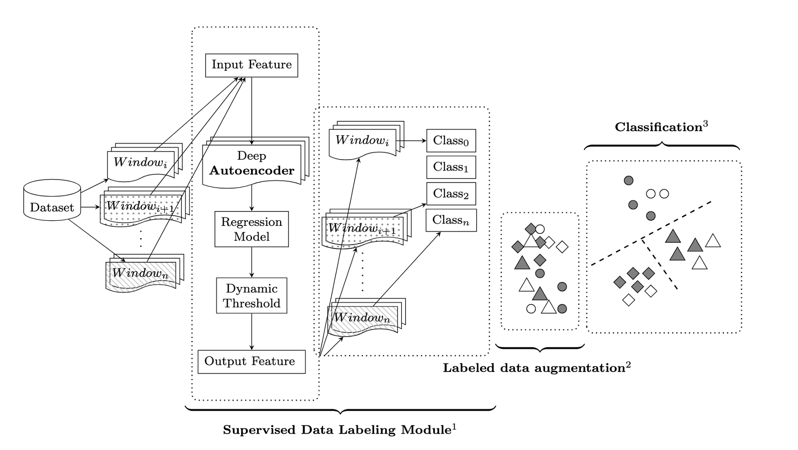

# **Dynamic Time Series Modeling with AI-Assisted Data Labeling**

### **Project Description**
This project implements a **dynamic time series modeling pipeline** using a combination of:
- **LSTM Autoencoder** for feature extraction,
- **Ridge Regression** for prediction and labeling,
- **CNN Classification** for downstream tasks,
- **Data Augmentation and Resampling** for handling imbalanced data.

It is designed for time-series datasets, enabling anomaly detection, prediction, and classification while generating key visualizations for insights.

---

## **System Architecture**

Below is the architecture diagram for the project:


---

## **Features**
- **LSTM Autoencoder:** Captures sequential dependencies in time-series data and extracts meaningful latent features.
- **Data Augmentation and Resampling:** Handles class imbalances using **SMOTE** and bootstrapping techniques.
- **Ridge Regression:** Predicts and labels time-series windows based on extracted features.
- **CNN Classification:** Classifies augmented time-series data into different categories.
- **Evaluation and Visualization:**
  - Regression performance metrics (e.g., R², RMSE).
  - Prediction intervals and anomaly detection.
  - Feature importance plots.
  - ROC curve visualization for multi-class classification.

---

## **Installation**

1. **Clone the Repository:**
   ```bash
   git clone https://github.com/yourusername/dynamic_time_series_project.git
   cd dynamic_time_series_project
